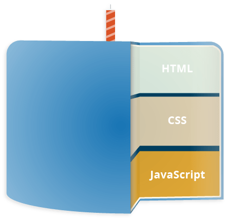

<!--

title: 'Javascript - ¿Qué es?'
description: 'Qué es JavaScript y que podemos hacer con él.'
date: '2022-02-16'
tag: 'Kapelu'

---

-->

<article>

<h1>JavaScript</h1>

`JavaScript` es un robusto lenguaje de programación que se puede aplicar a un documento HTML y usarse para crear interactividad dinámica en los sitios web. Fue inventado por Brendan Eich, cofundador del proyecto Mozilla, Mozilla Foundation y la Corporación Mozilla.

Puedes hacer casi cualquier cosa con JavaScript. Puedes empezar con pequeñas cosas como carruseles, galerías de imágenes, diseños fluctuantes, y respuestas a las pulsaciones de botones. Con más experiencia, serás capaz de crear juegos, animaciones 2D y gráficos 3D, aplicaciones integradas basadas en bases de datos ¡y mucho más!

JavaScript por sí solo es bastante compacto aunque muy flexible, y los desarrolladores han escrito gran cantidad de herramientas encima del núcleo del lenguaje JavaScript, desbloqueando una gran cantidad de funcionalidad adicional con un mínimo esfuerzo.

Es la tercera capa del pastel de las tecnologías web estándar, las dos primeras serian `HTML` y `CSS`.



- HTML es el lenguaje de marcado que usamos para estructurar y dar significado a nuestro contenido web, por ejemplo, definiendo párrafos, encabezados y tablas de datos, o insertando imágenes y videos en la página.

- CSS es un lenguaje de reglas de estilo que usamos para aplicar estilo a nuestro contenido HTML, por ejemplo, establecer colores de fondo y tipos de letra, y distribuir nuestro contenido en múltiples columnas.

- JavaScript es un lenguaje de secuencias de comandos que te permite crear contenido de actualización dinámica, controlar multimedia, animar imágenes y prácticamente todo lo demás. (Está bien, no todo, pero es sorprendente lo que puedes lograr con unas pocas líneas de código JavaScript).

Las tres capas se superponen muy bien. Tomemos una etiqueta de texto simple como ejemplo. Podemos marcarla usando HTML para darle estructura y propósito:

Veamos como funciona. Vamos a crear una carpeta y dentro de ella vamos a crear 3 archivos con los siguientes nombres, `index.html`, `style.css` y `script.js`.

`index.html`: Aqui creamos una estructura.

```html
<!DOCTYPE html>
<html lang="es">
  <head>
    <meta charset="UTF-8" />
    <meta name="viewport" content="width=device-width, initial-scale=1.0" />
    <title>¿Como Funciona JavaScript?</title>
    <link rel="stylesheet" href="./style.css" />
  </head>
  <body>
    <main>
      <p>Jugador 1: Kapelu</p>
    </main>
    <script src="./script.js"></script>
  </body>
</html>
```

`style.css`: Luego, podemos agregar algo de CSS a la mezcla para que se vea bien.

```css
p {
  font-family: "helvetica neue", helvetica, sans-serif;
  letter-spacing: 1px;
  text-transform: uppercase;
  text-align: center;
  border: 2px solid rgba(0, 0, 200, 0.6);
  background: rgba(0, 0, 200, 0.3);
  color: rgba(0, 0, 200, 0.6);
  box-shadow: 1px 1px 2px rgba(0, 0, 200, 0.4);
  border-radius: 10px;
  padding: 3px 10px;
  display: inline-block;
  cursor: pointer;
}
```

`JavaScript`: Finalmente, podemos agregar algo de JavaScript para implementar un comportamiento dinámico.

```js
const para = document.querySelector("p");

para.addEventListener("click", updateName);

function updateName() {
  let name = prompt("Ingresar nuevo nombre");
  para.textContent = "Jugador 1: " + name;
}
```

Aunque Javascript es ideal en muchos casos, es mucho más complicado aprender Javascript (o un lenguaje de programación de propósito general) que aprender HTML o CSS, los cuales son mucho más sencillos de comprender (o al menos, su base y fundamentos).

Antes de continuar debemos conocer varias detalles:

* Para `aprender Javascript` debemos conocer el lenguaje Javascript, pero no podremos hacerlo si no sabemos programar. Se puede aprender a programar con Javascript, pero es recomendable tener una serie de fundamentos básicos de programación antes para que no nos resulte muy duro.

* Para `aprender a programar` antes debemos saber como «trabaja una máquina». Programar no es más que decirle a una máquina que cosas debe hacer y como debe hacerlas. Eso significa que no podemos pasar por alto nada, o la máquina lo hará mal.

* Para `darle órdenes a una máquina` debemos tener claro que esas órdenes son correctas y harán lo que se supone que deben hacer. Si le indicamos a una máquina los pasos para resolver un problema, pero dichos pasos son erróneos, la máquina también hará mal el trabajo.


* Puedes copiar un programa en segundos, pero eso no significa que lo entiendas.
* Puedes comprender un programa en minutos, pero eso no significa que lo puedas crear.
* Puedes crear un programa en horas, pero eso no significa que sepas programar.
* Puedes aprender a programar en semanas, pero eso no significa que no cometas errores.
* Puedes aprender a programar bien y sin demasiados errores en meses.

> Pero dominar la programación es una tarea que requiere años.

Dicho esto, es necesario tener presente que aprender a programar es una tarea que no ocurre de un día para otro. Requiere tiempo, esfuerzo, acostumbrarse a cambiar la forma de pensar y practicar mucho.


Comienza a practicar [Aqui](https://codepen.io/kapelu/pen/RwOvRmP)!!!


</article>
